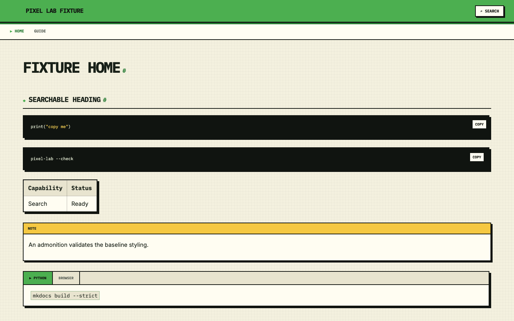
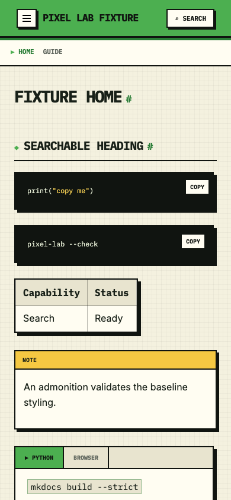

# Pixel Lab

Pixel Lab is a vibrant, accessible theme for [MkDocs](https://www.mkdocs.org/).

## Quick start

```bash
python -m pip install mkdocs-pixel-lab
```

Use it in `mkdocs.yml`:

```yaml
theme:
  name: pixel-lab
```

Pixel Lab includes a default favicon. Override it for a site-specific mark:

```yaml
theme:
  name: pixel-lab
  favicon: assets/favicon.svg
```

## Palette

Every theme color is configured from the single `theme:` block in `mkdocs.yml`.
The default palette preserves Pixel Lab’s original appearance; override only
the tokens your site needs:

```yaml
theme:
  name: pixel-lab

  # Brand
  header_background: "#8315F9"
  accent_color: "#8315F9"
  accent_dark_color: "#5E0AAE"
  accent_foreground_color: "#FFFFFF"

  # Neutrals used by every component
  background_color: "#f4f1df"
  surface_color: "#fffdf2"
  surface_alt_color: "#e8e4cf"
  text_color: "#182018"
  muted_text_color: "#5f665d"
  border_color: "#101410"
  shadow_color: "#101410"
```

`header_background` accepts any CSS background value, including a linear
gradient. All other options accept any valid CSS color, including `rgba()` and
CSS variables.

| Tokens | Used for |
| --- | --- |
| `background_color`, `surface_color`, `surface_alt_color` | Page, cards, input, and table surfaces. |
| `text_color`, `strong_text_color`, `muted_text_color` | Body, control, and secondary text. |
| `border_color`, `shadow_color`, `subtle_border_color`, `sidebar_border_color` | Component outlines, offset shadows, table rules, and navigation dividers. |
| `grid_color`, `overlay_color` | Page grid and mobile-navigation scrim. |
| `header_background`, `header_border_color`, `header_shadow_color`, `accent_color`, `accent_dark_color`, `accent_foreground_color` | Header, links, navigation, active states, and accent-filled controls. |
| `highlight_color`, `secondary_color`, `input_focus_background_color`, `inline_code_border_color`, `tab_hover_color` | Interactive controls, badges, inline code, and hover states. |
| `code_background_color`, `code_text_color`, `code_keyword_color`, `code_string_color`, `code_function_color`, `code_comment_color` | Code block and syntax-highlight colors. |
| `alert_note_color`, `alert_note_surface_color`, `alert_tip_color`, `alert_tip_surface_color`, `alert_important_color`, `alert_important_surface_color`, `alert_warning_color`, `alert_warning_surface_color`, `alert_caution_color`, `alert_caution_surface_color` | GitHub Alert rails, titles, and surfaces. |

This separation lets a site change its border and shadow independently without
having to maintain CSS overrides or edit the theme.

The analytics acceptance button uses `header_background` and
`accent_foreground_color`, matching the header background and site title
without separate color settings.

## GitHub Alerts

Enable GitHub-style Markdown alerts explicitly when a site uses them:

```yaml
markdown_extensions:
  - mkdocs_pixel_lab.github_alerts
```

The extension supports `NOTE`, `TIP`, `IMPORTANT`, `WARNING`, and `CAUTION`:

```markdown
> [!TIP]
>
> Use semantic callouts for important guidance.
```

Pixel Lab includes responsive navigation, search, code-copy controls, heading
fragment tracking, a skip link, and styling for standard MkDocs and Pymdown
content.

## Site navigation

An optional compact navigation lane can link related documentation sites.
Configure the displayed links, active site, catalog, and independent
header/footer capacities in `extra.site_navigation`:

```yaml
extra:
  site_navigation:
    show_header: true
    show_footer: true
    header_size: 4 # includes the catalog link
    footer_size: 7 # includes the catalog link
    footer_label: Packages
    items:
      - title: Core
        url: https://ml-pipes.com/
      - title: Supervision
        url: https://supervision.ml-pipes.com/
        active: true
      - title: Vision
        url: https://github.com/trained-by-humans/ml-pipes/tree/main/packages/vision
    catalog:
      title: All Packages →
      url: https://ml-pipes.com/PACKAGES/
```

Omit `site_navigation` to render neither lane. When it is configured,
`show_header` and `show_footer` independently control whether each lane is
rendered (both default to `true`). The header renders up to `header_size` links
and the footer up to `footer_size`; each capacity includes the catalog link. On
narrow screens, the header lane hides and the footer links stack vertically.

## Google Analytics 4

Analytics is off by default. Configure a GA4 Measurement ID (`G-…`, not a
Firebase API key or Google Tag Manager ID) and your privacy-notice URL to
enable the built-in opt-in prompt:

```yaml
site_url: https://ml-pipes.com/
theme:
  name: pixel-lab
extra:
  analytics:
    provider: google
    measurement_id: G-XXXXXXXXXX
    privacy_policy: https://ml-pipes.com/privacy/
```

`extra.analytics.privacy_policy` is required: a missing, empty, or
whitespace-only value keeps analytics off, without a Google tag, consent
prompt, or settings button. The same URL is used in the prompt and footer.
When analytics is enabled, the footer contains both **Privacy policy** and
**Analytics settings**. The policy link remains available if you later set
`enabled: false` while retaining the URL. Relative URLs such as `privacy/`
are resolved from nested documentation pages.

Pixel Lab does not supply a universal privacy policy for sites using the
theme. Sites under the same operator and privacy practices may link to one
shared notice that explicitly covers them.

The Google tag loads only after **Allow analytics**, or a previously saved
acceptance. **Decline** loads no Google tag. By default, choices are stored in
local storage per documentation site URL and Measurement ID. Separate project
paths on the same GitHub Pages hostname do not share consent. The footer's
**Analytics settings** button allows a visitor to change their choice.
Withdrawal disables collection,
removes the site's GA cookies, and reloads the page to unload the Google tag.
When browser storage is blocked, the choice applies only to the current page.
Advertising consent remains denied, and Google Signals and advertising
personalization are disabled.

To share a choice across a custom domain and its subdomains, explicitly set
the same `consent_domain` and Measurement ID on every participating site:

```yaml
extra:
  analytics:
    provider: google
    measurement_id: G-XXXXXXXXXX
    consent_domain: ml-pipes.com
    privacy_policy: https://ml-pipes.com/privacy/
```

Both acceptance and rejection are shared through a consent-only cookie scoped
to that domain, with `Secure`, `SameSite=Lax`, `Path=/`, and a 180-day lifetime.
The prompt identifies the shared domain. Use this only for sites you control
under the same privacy policy, not public suffixes or shared hosting domains
such as `github.io`. Unrelated or malformed domains disable analytics; browsers
reject public-suffix cookies. No parent domain is inferred automatically.
Changing the consent scope requires a new choice; old site-only preferences
are not silently promoted to domain-wide permission. Other open sites check
for changes on focus and periodically, including withdrawal. If storage
is blocked, explicit consent still applies only to the current page.

Only consent is shared: GA cookies remain hostname-specific, so this setting
does not enable cross-subdomain visitor identification.

Tracking is restricted to HTTPS pages matching the configured `site_url`
hostname, so local development and alternate-host previews do not collect
visits. Missing or invalid IDs leave tracking off. Set `enabled: false` under
`analytics` (or remove the block) to disable the integration. This is separate
from configuring `site_navigation`.

To set up the ML-Pipes documentation sites in Google:

1. In [Google Analytics](https://analytics.google.com/), create a GA4 property
   and a **Web** data stream for `https://ml-pipes.com/`.
2. Copy the stream's Measurement ID. Use the same ID in core, Supervision, and
   Ultralytics to aggregate reports; use **Hostname** to distinguish the sites.
   Set `consent_domain: ml-pipes.com` on all three sites for one domain-wide
   choice. Analytics cookies remain site-specific, so combined user counts
   are not deduplicated across subdomains.
3. In **Enhanced measurement → Page views → Advanced settings**, disable page
   changes based on browser history events. Pixel Lab changes heading fragments
   while scrolling; those are not separate page visits. For simple docs metrics,
   retain page loads, scrolls, outbound clicks, and file downloads; leave form
   interactions and site search off.
4. Publish a site privacy notice and set `extra.analytics.privacy_policy` to
   its URL. Review
   applicable consent requirements before deployment; this prompt is not a
   certification of legal compliance. Do not send personal information through
   events or page titles. Initial page URLs/referrers omit query strings and
   fragments; review any additional automatic events in your GA stream too.
5. Deploy with the ID, open a production page, and accept analytics. Check
   **Realtime** (allow time for standard reports). Test denial in a fresh browser
   context; Google requests should be absent.

The ID is public, not a secret. No API key, GitHub secret, Firebase SDK, or
separate subdomain property is required. With small traffic, these reports
describe consenting visitors, not every visit or an individual's identity.

References: [Google tag setup](https://developers.google.com/tag-platform/gtagjs)
and [consent implementation](https://developers.google.com/tag-platform/security/guides/consent).

## Preview

<table>
  <tr>
    <td align="center"></td>
    <td align="center"></td>
  </tr>
  <tr>
    <td align="center">Desktop</td>
    <td align="center">Mobile</td>
  </tr>
</table>

## Development

```bash
python -m pip install -e '.[test]'
playwright install chromium
pytest
```
