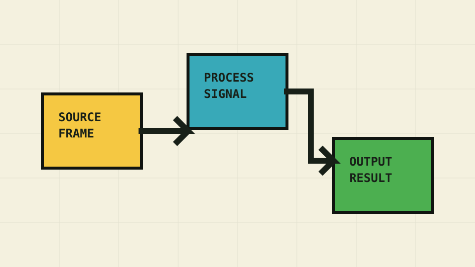

# Fixture home

## Searchable heading

```python
print("copy me")
```

| Capability | Status |
| --- | --- |
| Search | Ready |

!!! note
    An admonition validates the baseline styling.

=== "Python"

    `mkdocs build --strict`

=== "Browser"

    Open the fixture.

## Pipeline diagram


